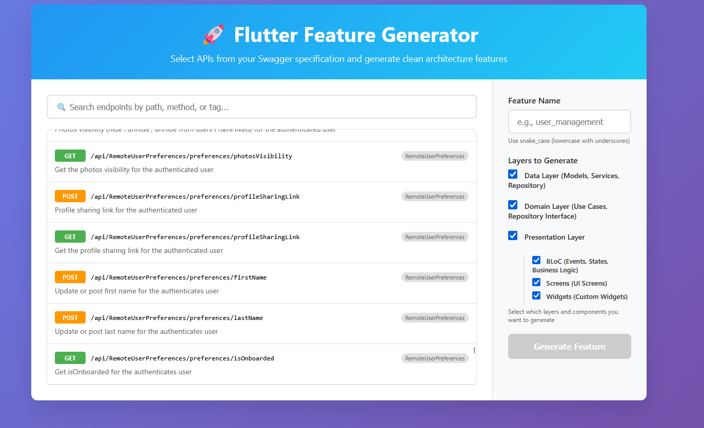

# Flutter Feature Generator

A powerful code generator with **interactive web interface** for creating clean architecture features in Flutter projects from OpenAPI/Swagger specifications.



## ✨ What's New in v2.0.0

🌐 **Interactive Web Interface**: Beautiful, modern web UI for selecting APIs and configuring generation
🎛️ **Granular Layer Control**: Choose exactly which layers to generate (Data, Domain, Presentation)
🧩 **Presentation Components**: Fine-grained control over BLoC, Screens, and Widgets
🔄 **Smart Appending**: Automatically appends to existing features instead of overwriting
📝 **Consolidated Classes**: Adds methods to existing classes instead of creating separate ones
🎯 **Real-time Search**: Filter APIs by path, method, tag, or description
✅ **Multi-Selection**: Select multiple endpoints with visual feedback

## Features

- 🌐 **Modern Web Interface**: Interactive UI for API selection and configuration
- 🏗️ **Clean Architecture**: Generates complete feature structure following clean architecture principles
- 📄 **Swagger Integration**: Automatically parses OpenAPI/Swagger specifications
- 🎛️ **Granular Control**: Choose specific layers and components to generate
- 🔄 **Smart Appending**: Add new APIs to existing features without overwriting
- 🎯 **Interactive Selection**: Multi-select APIs with search and filtering
- 📁 **Flexible Structure**: Configurable project structure and paths
- 🔒 **Name Validation**: Prevents conflicts with reserved folder names
- 📱 **Responsive Design**: Works on desktop and mobile browsers

## Installation

### Global Installation (Recommended)

```bash
dart pub global activate flutter_feature_generator
```

### Local Installation

Add to your `pubspec.yaml`:

```yaml
dev_dependencies:
  flutter_feature_generator: ^2.0.0
```

Then run:

```bash
dart pub get
```

## Usage

### Web Interface (New!)

Start the interactive web interface:

```bash
# Run in your Flutter project root
flutter_feature_generator

# Or explicitly start web mode
flutter_feature_generator --web
```

Then open your browser and navigate to: **http://localhost:8080**

#### Web Interface Features:
- 🔍 **Search & Filter**: Find APIs by path, method, tag, or description
- ✅ **Multi-Selection**: Click to select/deselect multiple endpoints
- 🎛️ **Layer Control**: Choose which layers to generate:
  - **Data Layer**: Models, Services, Repository Implementation
  - **Domain Layer**: Use Cases, Repository Interface
  - **Presentation Layer**: BLoC, Screens, Widgets (individually selectable)
- 📝 **Smart Validation**: Real-time feature name validation
- 🎯 **Visual Feedback**: Clear status messages and progress indicators

### Command Line Interface

For automation and scripting, you can still use the CLI:

```bash
# Show available endpoints and usage
flutter_feature_generator

# Generate feature with specific endpoints
flutter_feature_generator user_management 1,3,5

# Generate all endpoints
flutter_feature_generator api_features all
```

### Layer Selection

Choose exactly what you need:

#### Full Stack
- ✅ Data Layer
- ✅ Domain Layer  
- ✅ Presentation Layer (BLoC + Screens + Widgets)

#### Backend Only
- ✅ Data Layer
- ✅ Domain Layer
- ❌ Presentation Layer

#### Business Logic Only
- ❌ Data Layer
- ✅ Domain Layer
- ✅ Presentation Layer (BLoC only)

#### UI Only
- ❌ Data Layer
- ❌ Domain Layer
- ✅ Presentation Layer (Screens + Widgets only)

## Project Structure

The generator creates features following this clean architecture structure:

```
lib/features/your_feature/
├── data/                          # Data Layer
│   ├── model/
│   │   ├── request_model.dart
│   │   └── response_model.dart
│   ├── remote/
│   │   ├── service/
│   │   │   └── your_feature_service.dart      # Retrofit API calls
│   │   └── source/
│   │       ├── your_feature_source.dart       # Data source interface
│   │       └── your_feature_source_impl.dart  # Data source implementation
│   └── repository/
│       └── your_feature_repository_impl.dart  # Repository implementation
├── domain/                        # Domain Layer
│   ├── repository/
│   │   └── your_feature_repository.dart       # Repository interface
│   └── usecase/
│       └── your_feature_usecase.dart          # Business logic
└── presentation/                  # Presentation Layer
    ├── bloc/                      # State Management
    │   ├── your_feature_bloc.dart
    │   ├── your_feature_event.dart
    │   └── your_feature_state.dart
    ├── screen/                    # UI Screens
    │   └── your_feature_screen.dart
    └── widget/                    # Custom Widgets
```

## Smart Appending

When you add new APIs to an existing feature, the generator intelligently:

- ✅ **Adds methods** to existing UseCases class
- ✅ **Adds factory methods** to existing freezed Event class  
- ✅ **Adds fields** to existing freezed State class
- ✅ **Adds handlers** to existing BLoC class
- ✅ **Adds methods** to Repository interface and implementation
- ✅ **Adds methods** to Source interface and implementation
- ✅ **Adds endpoints** to Service class
- ✅ **Generates missing models** only
- ❌ **Never overwrites** existing code

## Requirements

- Dart SDK: >=3.0.0 <4.0.0
- A `swagger.json` or OpenAPI specification file in your project root
- Flutter project with standard structure

## Configuration

### Swagger/OpenAPI File

Place your API specification file (`swagger.json` or `openapi.yaml`) in your project root. The web interface will automatically load and parse it.

### Feature Naming

Feature names must follow snake_case format (e.g., `user_management`, `chat_system`).

**Restricted Names** (to prevent conflicts):
- `test`, `build`, `lib`
- `android`, `ios`, `web`, `windows`, `linux`, `macos`

## Examples

### Web Interface Workflow

1. **Start the server**:
   ```bash
   flutter_feature_generator
   ```

2. **Open browser**: Navigate to `http://localhost:8080`

3. **Select APIs**: Use search and multi-select to choose endpoints

4. **Configure layers**: Select which components to generate

5. **Set feature name**: Enter a snake_case name (e.g., `user_profile`)

6. **Generate**: Click "Generate Feature" and see real-time progress

### CLI Workflow

1. **Show available APIs**:
   ```bash
   flutter_feature_generator
   ```

2. **Generate specific endpoints**:
   ```bash
   flutter_feature_generator user_management 1,3,5,7
   ```

3. **Generate all endpoints**:
   ```bash
   flutter_feature_generator complete_api all
   ```

## Generated Files Integration

After generation, complete the integration:

1. **Generate build files**:
   ```bash
   dart run build_runner build
   ```

2. **Add to dependency injection**: Register repository and BLoC in your DI container

3. **Use in your app**: Import and use the generated components

Example BLoC usage:
```dart
BlocProvider(
  create: (context) => UserManagementBloc(
    GetIt.instance<UserManagementUseCases>(),
  ),
  child: UserManagementScreen(),
)
```

## Publishing to pub.dev

To publish this package to pub.dev instead of onepub:

1. **Remove onepub configuration**:
   ```bash
   # The publish_to line has been commented out in pubspec.yaml
   ```

2. **Login to pub.dev**:
   ```bash
   dart pub login
   ```

3. **Dry run**:
   ```bash
   dart pub publish --dry-run
   ```

4. **Publish**:
   ```bash
   dart pub publish
   ```

## Contributing

1. Fork the repository
2. Create your feature branch (`git checkout -b feature/amazing-feature`)
3. Commit your changes (`git commit -m 'Add some amazing feature'`)
4. Push to the branch (`git push origin feature/amazing-feature`)
5. Open a Pull Request

## License

This project is licensed under the MIT License - see the [LICENSE](LICENSE) file for details.

## Changelog

See [CHANGELOG.md](CHANGELOG.md) for a list of changes in each version.

---

Made with ❤️ for the Flutter community